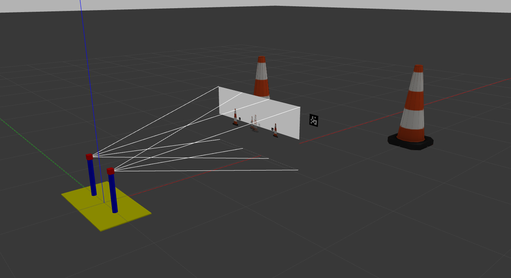

# gazebo_camera



Launch simulation and control node:
```
roslaunch gazebo_camera gazebo_cameras.launch
roslaunch gazebo_camera pan_control.launch
```

Set camera angles:
```
rostopic pub -1 /test_cameras/joint1_position_controller/command std_msgs/Float64 "data: 0.5"
rostopic pub -1 /test_cameras/joint2_position_controller/command std_msgs/Float64 "data: -0.5"
```
